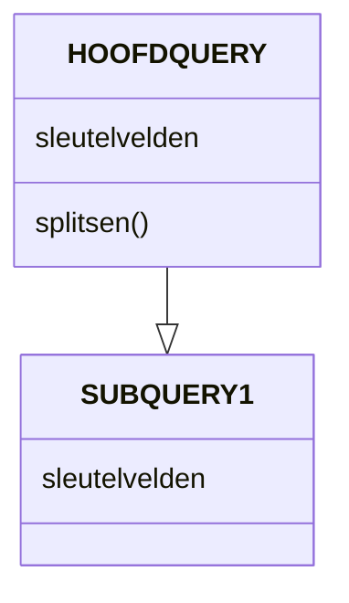

```mermaid
classDiagram
    HOOFDQUERY: sleutelvelden
    HOOFDQUERY: splitsen()
    HOOFDQUERY --|> SUBQUERY1
  
class SUBQUERY1{
      sleutelvelden
    }

```
HOOFDQUERY-->|sleutelvelden|SUBQUERY1;
  HOOFDQUERY-->|sleutelvelden|SUBQUERY2;
    SUBQUERY1-->|sleutelvelden|SUBQUERY1_2;
