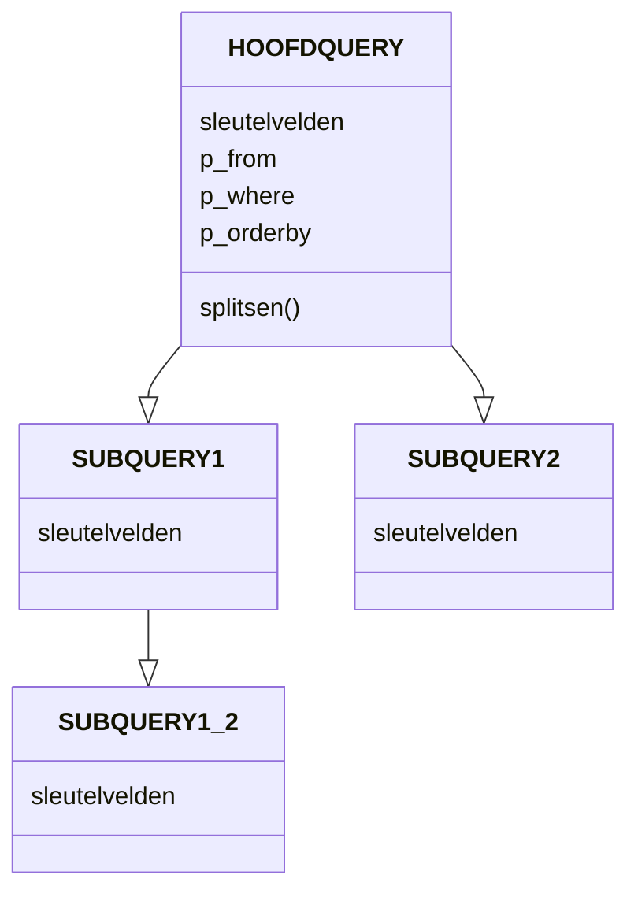

```mermaid
classDiagram
    HOOFDQUERY: sleutelvelden
    HOOFDQUERY: p_from
    HOOFDQUERY: p_where
    HOOFDQUERY: p_orderby
    HOOFDQUERY: splitsen()
    HOOFDQUERY --|> SUBQUERY1
    HOOFDQUERY --|> SUBQUERY2
    SUBQUERY1 --|> SUBQUERY1_2
  
class SUBQUERY1{
      sleutelvelden
      
    }

class SUBQUERY2{
      sleutelvelden
    }
class SUBQUERY1_2{
      sleutelvelden
    }

```

